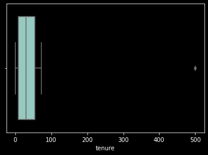
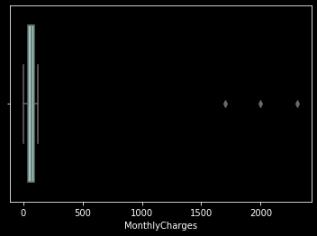
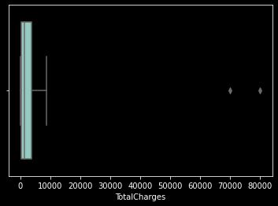

# Tugas dan Langkah
Sebagai seorang data scientist, kamu diminta untuk menyiapkan data sebelum di lakukan permodelan.
Pada tugas kali ini, kamu akan melakukan Data Prepocessing (Data Cleansing) bulan lalu, yakni Juni 2020.
Langkah yang akan dilakukan adalah,

    Mencari ID pelanggan (Nomor telphone) yang valid
    Mengatasi data-data yang masih kosong (Missing Values)
    Mengatasi Nilai-Nilai Pencilan (Outlier) dari setiap Variable
    Menstandarisasi Nilai dari Variable


# Data yang Digunakan

Untuk Dataset yang digunakan sudah disediakan dalam format csv, silahkan baca melalui fungsi pandas di python df_load = pd.read_csv('https://storage.googleapis.com/dqlab-dataset/dqlab_telco.csv')
 

Untuk detil datanya adalah sebagai berikut:

   * UpdatedAt Periode of Data taken
   * customerID Customer ID
   * gender Whether the customer is a male or a female (Male, Female)
   * SeniorCitizen Whether the customer is a senior citizen or not (1, 0)
   * Partner Whether the customer has a partner or not (Yes, No)
   * Dependents Whether the customer has dependents or not (Yes, No)
   * tenure Number of months the customer has stayed with the company
   * PhoneService Whether the customer has a phone service or not (Yes, No)
   * MultipleLines Whether the customer has multiple lines or not (Yes, No, No phone service)
   * InternetService Customer’s internet service provider (DSL, Fiber optic, No)
   * OnlineSecurity Whether the customer has online security or not (Yes, No, No internet service)
   * OnlineBackup Whether the customer has online backup or not (Yes, No, No internet service)
   * DeviceProtection Whether the customer has device protection or not (Yes, No, No internet service)
   * TechSupport Whether the customer has tech support or not (Yes, No, No internet service)
   * StreamingTV Whether the customer has streaming TV or not (Yes, No, No internet service)
   * StreamingMovies Whether the customer has streaming movies or not (Yes, No, No internet service)
   * Contract The contract term of the customer (Month-to-month, One year, Two year)
   * PaperlessBilling Whether the customer has paperless billing or not (Yes, No)
   * PaymentMethod The customer’s payment method (Electronic check, Mailed check, Bank transfer (automatic), Credit card (automatic))
   * MonthlyCharges The amount charged to the customer monthly
   * TotalCharges The total amount charged to the customer
   * Churn Whether the customer churned or not (Yes or No)


```python
# Importing Data Source
import pandas as pd
import matplotlib as plt
import seaborn as sns
pd.options.display.max_columns = 50


df_load = pd.read_csv('https://dqlab-dataset.s3-ap-southeast-1.amazonaws.com/dqlab_telco.csv')
print(df_load.shape)
print(df_load.head(5))
print(df_load.customerID.nunique())
```

    (7113, 22)
       UpdatedAt   customerID  gender  SeniorCitizen Partner Dependents  tenure  \
    0     202006  45759018157  Female              0     Yes         No     1.0   
    1     202006  45557574145    Male              0      No         No    34.0   
    2     202006  45366876421    Male              0      No         No     2.0   
    3     202006  45779536532    Male              0      No         No    45.0   
    4     202006  45923787906  Female              0      No         No     2.0   
    
      PhoneService     MultipleLines InternetService OnlineSecurity OnlineBackup  \
    0           No  No phone service             DSL             No          Yes   
    1          Yes                No             DSL            Yes           No   
    2          Yes                No             DSL            Yes          Yes   
    3           No  No phone service             DSL            Yes           No   
    4          Yes                No     Fiber optic             No           No   
    
      DeviceProtection TechSupport StreamingTV StreamingMovies        Contract  \
    0               No          No          No              No  Month-to-month   
    1              Yes          No          No              No        One year   
    2               No          No          No              No  Month-to-month   
    3              Yes         Yes          No              No        One year   
    4               No          No          No              No  Month-to-month   
    
      PaperlessBilling              PaymentMethod  MonthlyCharges  TotalCharges  \
    0              Yes           Electronic check           29.85         29.85   
    1               No               Mailed check           56.95       1889.50   
    2              Yes               Mailed check           53.85        108.15   
    3               No  Bank transfer (automatic)           42.30       1840.75   
    4              Yes           Electronic check           70.70        151.65   
    
      Churn  
    0    No  
    1    No  
    2   Yes  
    3    No  
    4   Yes  
    7017
    

# Memfilter ID Number Pelanggan Format Tertentu
Mencari format ID Number (Phone Number) Pelanggan customerID yang benar, dengan kriteria:

    Panjang karakter adalah 11-12.
    Terdiri dari Angka Saja, tidak diperbolehkan ada karakter selain angka
    Diawali dengan angka 45 2 digit pertama.

 

Gunakan fungsi count() untuk menghitung banyaknya rows Customer ID, anda juga bisa menggunakan str.match() & regex untuk mencocokan dengan kriteria diatas. Jangan lupa gunakan astype() untuk merubah tipe datanya yang semula numeric


```python
df_load['valid_id'] = df_load['customerID'].astype(str).str.match(r'(45\d{9,10})')
df_load = (df_load[df_load['valid_id'] == True]).drop('valid_id', axis = 1)
print('Hasil jumlah ID Customer yang terfilter adalah',df_load['customerID'].count())
```

    Hasil jumlah ID Customer yang terfilter adalah 7006
    


```python
# Drop Duplicate Rows
df_load.drop_duplicates()
# Drop duplicate ID sorted by Periode
df_load = df_load.sort_values('UpdatedAt', ascending=False).drop_duplicates(['customerID'])
print('Hasil jumlah ID Customer yang sudah dihilangkan duplikasinya (distinct) adalah',df_load['customerID'].count())
```

    Hasil jumlah ID Customer yang sudah dihilangkan duplikasinya (distinct) adalah 6993
    

# Mengatasi Missing Values dengan Penghapusan Rows

Selanjutnya kita akan menghapus Rows dari data-data yang tidak terdeteksi apakah dia churn atau tidak. Di asumsikan data modeller hanya mau menerima data yang benar ada flag churn nya atau tidak.


```python
print('Total missing values data dari kolom Churn',df_load['Churn'].isnull().sum())
# Dropping all Rows with spesific column (churn)
df_load.dropna(subset=['Churn'],inplace=True)
print('Total Rows dan kolom Data setelah dihapus data Missing Values adalah',df_load.shape)
```

    Total missing values data dari kolom Churn 43
    Total Rows dan kolom Data setelah dihapus data Missing Values adalah (6950, 22)
    

# Mengatasi Missing Values dengan Pengisian Nilai tertentu

Selain dengan mengapus rows dari data, menangani missing values bisa menggunakan nilai tertentu. Diasumsikan data modeller meminta pengisian missing values dengan kriteria berikut:

   * Tenure pihak data modeller meminta setiap rows yang memiliki missing values untuk Lama berlangganan di isi dengan 11
   * Variable yang bersifat numeric selain Tenure di isi dengan median dari masing-masing variable tersebut


```python
print('Status Missing Values :',df_load.isnull().values.any())
print('\nJumlah Missing Values masing-masing kolom, adalah:')
print(df_load.isnull().sum().sort_values(ascending=False))

# handling missing values Tenure fill with 11
df_load['tenure'].fillna(11, inplace=True)

# Handling missing values num vars (except Tenure)
for col_name in list(['MonthlyCharges','TotalCharges']):
    median = df_load[col_name].median()
    df_load[col_name].fillna(median, inplace=True)

print('\nJumlah Missing Values setelah di imputer datanya, adalah:')
print(df_load.isnull().sum().sort_values(ascending=False))
```

    Status Missing Values : True
    
    Jumlah Missing Values masing-masing kolom, adalah:
    tenure              99
    MonthlyCharges      26
    TotalCharges        15
    UpdatedAt            0
    DeviceProtection     0
    PaymentMethod        0
    PaperlessBilling     0
    Contract             0
    StreamingMovies      0
    StreamingTV          0
    TechSupport          0
    OnlineBackup         0
    customerID           0
    OnlineSecurity       0
    InternetService      0
    MultipleLines        0
    PhoneService         0
    Dependents           0
    Partner              0
    SeniorCitizen        0
    gender               0
    Churn                0
    dtype: int64
    
    Jumlah Missing Values setelah di imputer datanya, adalah:
    UpdatedAt           0
    customerID          0
    TotalCharges        0
    MonthlyCharges      0
    PaymentMethod       0
    PaperlessBilling    0
    Contract            0
    StreamingMovies     0
    StreamingTV         0
    TechSupport         0
    DeviceProtection    0
    OnlineBackup        0
    OnlineSecurity      0
    InternetService     0
    MultipleLines       0
    PhoneService        0
    tenure              0
    Dependents          0
    Partner             0
    SeniorCitizen       0
    gender              0
    Churn               0
    dtype: int64
    

# Mendeteksi adanya Outlier (Boxplot)

Mendeteksi Pencilan dari suatu Nilai (Outlier) salah satunya bisa melihat plot dari data tersebut menggunakan Box Plot. Boxplot merupakan ringkasan distribusi sampel yang disajikan secara grafis yang bisa menggambarkan bentuk distribusi data (skewness), ukuran tendensi sentral dan ukuran penyebaran (keragaman) data pengamatan.


```python
print('\nPersebaran data sebelum ditangani Outlier: ')
print(df_load[['tenure','MonthlyCharges','TotalCharges']].describe())
import matplotlib.pyplot as plt
import seaborn as sns
plt.style.use('dark_background')
# Masukkan variable
plt.figure() # untuk membuat figure baru
sns.boxplot(x=df_load['tenure'])
plt.show()

plt.figure() # untuk membuat figure baru
sns.boxplot(x=df_load['MonthlyCharges'])
plt.show()

plt.figure()
sns.boxplot(x=df_load['TotalCharges'])
plt.show()
```

    
    Persebaran data sebelum ditangani Outlier: 
                tenure  MonthlyCharges  TotalCharges
    count  6950.000000     6950.000000   6950.000000
    mean     32.477266       65.783741   2305.083460
    std      25.188910       50.457871   2578.651143
    min       0.000000        0.000000     19.000000
    25%       9.000000       36.462500    406.975000
    50%      29.000000       70.450000   1400.850000
    75%      55.000000       89.850000   3799.837500
    max     500.000000     2311.000000  80000.000000
    


    

    


    

    


    

    


# Mengatasi Outlier

Setelah kita mengetahui variable mana saja yang terdapat pencilan (Outlier), selanjutnya kita akan atasi Outlier dengan menggunakan metode interquartile range (IQR). 


```python
# Handling with IQR
Q1 = (df_load[['tenure','MonthlyCharges','TotalCharges']]).quantile(0.25)
Q3 = (df_load[['tenure','MonthlyCharges','TotalCharges']]).quantile(0.75)

IQR = Q3 - Q1
maximum = Q3 + (1.5*IQR)
print('Nilai Maximum dari masing-masing Variable adalah: ')
print(maximum)
minimum = Q1 - (1.5*IQR)
print('\nNilai Minimum dari masing-masing Variable adalah: ')
print(minimum)

more_than = (df_load > maximum)
lower_than = (df_load < minimum)
df_load = df_load.mask(more_than, maximum, axis=1)
df_load = df_load.mask(lower_than, minimum, axis=1)

print('\nPersebaran data setelah ditangani Outlier: ')
print(df_load[['tenure','MonthlyCharges','TotalCharges']].describe())
```

    Nilai Maximum dari masing-masing Variable adalah: 
    tenure             124.00000
    MonthlyCharges     169.93125
    TotalCharges      8889.13125
    dtype: float64
    
    Nilai Minimum dari masing-masing Variable adalah: 
    tenure             -60.00000
    MonthlyCharges     -43.61875
    TotalCharges     -4682.31875
    dtype: float64
    
    Persebaran data setelah ditangani Outlier: 
                tenure  MonthlyCharges  TotalCharges
    count  6950.000000     6950.000000   6950.000000
    mean     32.423165       64.992201   2286.058750
    std      24.581073       30.032040   2265.702553
    min       0.000000        0.000000     19.000000
    25%       9.000000       36.462500    406.975000
    50%      29.000000       70.450000   1400.850000
    75%      55.000000       89.850000   3799.837500
    max     124.000000      169.931250   8889.131250
    

    c:\users\fikri\appdata\local\programs\python\python37\lib\site-packages\ipykernel_launcher.py:13: FutureWarning: Automatic reindexing on DataFrame vs Series comparisons is deprecated and will raise ValueError in a future version.  Do `left, right = left.align(right, axis=1, copy=False)` before e.g. `left == right`
      del sys.path[0]
    c:\users\fikri\appdata\local\programs\python\python37\lib\site-packages\ipykernel_launcher.py:14: FutureWarning: Automatic reindexing on DataFrame vs Series comparisons is deprecated and will raise ValueError in a future version.  Do `left, right = left.align(right, axis=1, copy=False)` before e.g. `left == right`
      
    

# Mendeteksi Nilai yang tidak Standar

Mendeteksi apakah ada nilai-nilai dari variable kategorik yang tidak standard. Hal ini biasanya terjadi dikarenakan kesalahan input data. Perbedaan istilah menjadi salah satu faktor yang sering terjadi, untuk itu dibutuhkan standarisasi dari data yang sudah terinput.


```python
# Masukkan variable
for col_name in list(['gender','SeniorCitizen','Partner','Dependents','PhoneService','MultipleLines','InternetService','OnlineSecurity','OnlineBackup','DeviceProtection','TechSupport','StreamingTV','StreamingMovies','Contract','PaperlessBilling','PaymentMethod','Churn']):
    print('\nUnique Values Count \033[1m' + 'Before Standardized \033[0m Variable',col_name)
    print(df_load[col_name].value_counts())
    
df_load = df_load.replace(['Wanita','Laki-Laki','Churn','Iya'],['Female','Male','Yes','Yes'])

# Masukkan variable
for col_name in list(['gender','Dependents','Churn']):
    print('\nUnique Values Count \033[1m' + 'After Standardized \033[0mVariable',col_name)
    print(df_load[col_name].value_counts())
```

    
    Unique Values Count Before Standardized  Variable gender
    Male         3499
    Female       3431
    Wanita         14
    Laki-Laki       6
    Name: gender, dtype: int64
    
    Unique Values Count Before Standardized  Variable SeniorCitizen
    0    5822
    1    1128
    Name: SeniorCitizen, dtype: int64
    
    Unique Values Count Before Standardized  Variable Partner
    No     3591
    Yes    3359
    Name: Partner, dtype: int64
    
    Unique Values Count Before Standardized  Variable Dependents
    No     4870
    Yes    2060
    Iya      20
    Name: Dependents, dtype: int64
    
    Unique Values Count Before Standardized  Variable PhoneService
    Yes    6281
    No      669
    Name: PhoneService, dtype: int64
    
    Unique Values Count Before Standardized  Variable MultipleLines
    No                  3346
    Yes                 2935
    No phone service     669
    Name: MultipleLines, dtype: int64
    
    Unique Values Count Before Standardized  Variable InternetService
    Fiber optic    3057
    DSL            2388
    No             1505
    Name: InternetService, dtype: int64
    
    Unique Values Count Before Standardized  Variable OnlineSecurity
    No                     3454
    Yes                    1991
    No internet service    1505
    Name: OnlineSecurity, dtype: int64
    
    Unique Values Count Before Standardized  Variable OnlineBackup
    No                     3045
    Yes                    2400
    No internet service    1505
    Name: OnlineBackup, dtype: int64
    
    Unique Values Count Before Standardized  Variable DeviceProtection
    No                     3054
    Yes                    2391
    No internet service    1505
    Name: DeviceProtection, dtype: int64
    
    Unique Values Count Before Standardized  Variable TechSupport
    No                     3431
    Yes                    2014
    No internet service    1505
    Name: TechSupport, dtype: int64
    
    Unique Values Count Before Standardized  Variable StreamingTV
    No                     2774
    Yes                    2671
    No internet service    1505
    Name: StreamingTV, dtype: int64
    
    Unique Values Count Before Standardized  Variable StreamingMovies
    No                     2747
    Yes                    2698
    No internet service    1505
    Name: StreamingMovies, dtype: int64
    
    Unique Values Count Before Standardized  Variable Contract
    Month-to-month    3823
    Two year          1670
    One year          1457
    Name: Contract, dtype: int64
    
    Unique Values Count Before Standardized  Variable PaperlessBilling
    Yes    4114
    No     2836
    Name: PaperlessBilling, dtype: int64
    
    Unique Values Count Before Standardized  Variable PaymentMethod
    Electronic check             2337
    Mailed check                 1594
    Bank transfer (automatic)    1519
    Credit card (automatic)      1500
    Name: PaymentMethod, dtype: int64
    
    Unique Values Count Before Standardized  Variable Churn
    No       5114
    Yes      1827
    Churn       9
    Name: Churn, dtype: int64
    
    Unique Values Count After Standardized Variable gender
    Male      3505
    Female    3445
    Name: gender, dtype: int64
    
    Unique Values Count After Standardized Variable Dependents
    No     4870
    Yes    2080
    Name: Dependents, dtype: int64
    
    Unique Values Count After Standardized Variable Churn
    No     5114
    Yes    1836
    Name: Churn, dtype: int64
    

# FIN 
